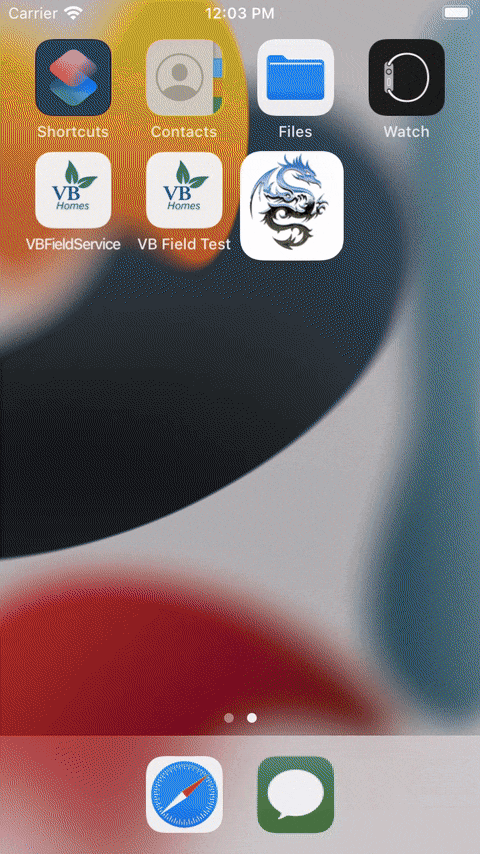

# Marvel Character Finder!

<i>When the universe is in danger, many heroes appear, but you need to assign the right one for the job. Marvel Character Finder allows you to do just that. Many universes will thank you!</i>

<ul>
<li>Have you ever lost a universe for sending the wrong superhero?</li>
<li>Do you keep wondering if some hero is from DC Comics?</li>
<li>Never remember if some hero uses cape or not?</li>
<li>Get confused with villains that have cute names?</li>
</ul>
  

    

<h2>Say Goodbye to your Marvel information problems!</i> 👋🏼</h2>

Let the Marvel Character Finder save your world! (Or even your universe)

## Marvel Character Finder! Technical Features 🤓
- Master and Detail view.
- Use of MVP Pattern to avoid massive ViewControllers with a lot of responsabilities.
- REST requests with API Key authentication.
- Programmatic definition of views.
- Swift 5 (The best and the newest for our valued customers)
- Table view with autoresizing rows
- Unit Tests.
- Localizable strings.
- A readme with silly jokes.

## Teaser (ESBR Rating Pending)

    

## Testimonials

    

<i>I dare you to use the Marvel Character Finder!</i> 

## Author

Andrés Acevedo is an iOS developer from Colombia with more than 10 years of experience developing awesome apps.

<ul>
<li><a href="https://acetips.medium.com/">Tips and lifehacks</a> </li>
</ul>
